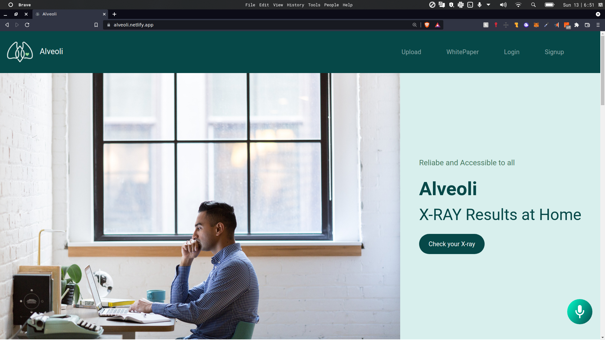
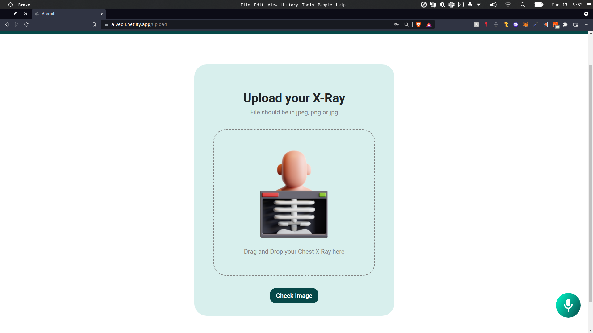

# **Alveoli**


[](https://alveoli.netlify.app/) &nbsp;
[](https://youtu.be/-oIkk6cyrVo) &nbsp;
[](https://drive.google.com/file/d/1Xg97BXAq1tfJX_skNDN3VlnBjlYgj8iz/view?usp=sharing) &nbsp;
[](https://www.youtube.com/watch?v=-oIkk6cyrVo)


&nbsp;


&nbsp;


# About Project

Chest X-Ray Classification:

-   Website and app that can detect covid, pneumonia, tuberculosis.
-   Deep Learning has been used to detect the disease by using a Convolutional Neural Network(MobileNetV2) which performs classification
-   Decentralised and Secure


# Working Explanation

1.  Create a account and Login to the website
    
2.  Checkout the upload page to check your X-Ray.
    
3.  Result will be displayed.
    
4.  Precautions and safety measures are also provided depending upon the result of the X-Ray.
    
5.  Can also check the profile page for previous X-Ray checks.
# Notable Features

-   This project helps users check their Chest X-Ray reports in a matter of seconds.
    
-   A Chest X-Ray image classification based website and app that can detect Covid-19, Pneumonia and Tuberculosis.
    
-   A decentralised and secure chest X-Ray classification website.
    
-   The user can login and upload an image of the Chest X-Ray which will be safely secured on Blockchain.
    
-   Alan AI has also been integrated for smooth workflow.
    
-   The user can also view a history of their medical chest X-Ray reports which can be downloaded in the form of a pdf.

#  Tech Stack

<p float="left">
    
  
  
    
  
  
    
  
  
    
  
  
    
</p>

### IPFS, Alan AI

# DataSet
- <a href=https://www.kaggle.com/datasets/jtiptj/chest-xray-pneumoniacovid19tuberculosis> Chest X-Ray (Pneumonia,Covid-19,Tuberculosis) </a>

# *Installation Requirements*
 

 - [x] React
 - [x] Node

 1. Clone the repository to your local machine
    ```
    git clone https://github.com/Codificacion-Circulo/Alveoli.git
    ```

2. Move to the web-app and backend and install all the dependencies
    ```
    npm install
    ```

3. Move to the backend folder and run the development environment
    ```
    npm run dev
    ```

4. Move to the web-app folder and run the Development Environment
    ```
    npm start
    ```

# Resources:
- <a href=https://www.mdpi.com/2079-9292/10/13/1512>Pneumonia Detection from Chest X-ray Images Based on Convolutional Neural Network</a>
- <a href=https://www.mdpi.com/2673-8112/1/1/34>Detecting Coronavirus from Chest X-rays Using Transfer Learning</a>
